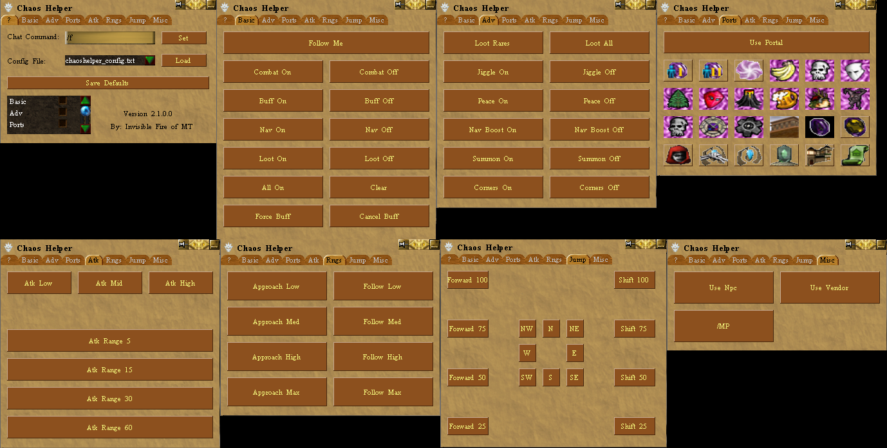

# ChaosHelper

This is a simple, yet useful (I'm biased), decal plugin that will allow you to customize your commands and make everything a push button instead of using hotkeys and/or chat commands.



To use this plugin, add the files in the zip to the same directory of your choice and add the dll to decal.

To change where you wish the chat text to go, aka /f, /a, etc... modify Chat command: text box and press the 'set' button..

To customize this plugin modify the `chaoshelper_config.txt`, or any loaded config file. (you can do this while in game, and reload after you save your changes by going to the ? tab and pressing Load button).

to customize the view, modify `main.layout` or create a new one. Be sure to specify the layout in the top of the config file as it appears in the default file this plugin comes with. Examples Below

A new button was added in v1.2 which allows you to save your defaults. Go to the ? tab and press the save defaults button to save any changes you've made.

New Chat commands were added in v1.2 which allows you to load configs and set chat command through the chat window / metas / etc.
## Chat Commands:
- /ch help
- /ch setprofile profileName.txt
- /ch setchatcommand /f
- /ch settab #

## UI Controls Configuration File (_default: `chaoshelper_config.txt`_)

###### Important Note : columns represented by commas ','

### First Line : This is the layout that will be associated with the controls layout. Every config needs a layout!

_ex:_ `LAYOUT: main.layout`

### All Other Lines : These define custom properties for your controls. Each entry needs 2-3 columns!

_ex:_ `Adv_Button_01,Loot Rares,!loot rares`

_ex:_ `Basic_StaticText_08,Combat Section` _**(NEW)**_

_ex:_ `Basic_ToggleButton_04,Combat,!combat on,!combat off` _**(NEW)**_

##### The columns are broken-down here:

#### (1) FIRST COLUMN: this is how the script knows which controls to set to what.

_ex:_ **Adv\_Button\_01**_,Loot Rares,!loot rares_

##### Follows the format: `<TabName>_<ControlType>_<##>`

###### `<TabName>` should be replaced with:
- `Basic`
- `Adv`
- _any of your custom tabs as defined in your `.layout` file_
  
###### `<ControlType>` should be replaced with:
  - `Button` - a clickable button which issues a command
  - `StaticText` - a text label _**(NEW)**_
  - `ToggleButton` - a toggleable button which issues either an ON command or OFF command _**(NEW)**_

###### `<##>` instance should be replaced with:
  - `01` and incrementing for each control you add
  
#### (2) SECOND COLUMN: This is the text of the control. Set it how ever you wish!

_ex:_ _Adv\_Button\_01,_**Loot Rares**_,!loot rares_
  
- If you wish for the control to be not visible, set the text to be NOTSET and it will hide from the screen.  
- If you want a control to have an icon, add the icon value (Decimal! NOT Hex!) in brackets Example: [12345]
  
#### (3) THIRD COLUMN: This is the command that will be sent to the chat

_ex:_ _Adv\_Button\_01,Loot Rares,_**!loot rares**
  
- You can now use any command prefix, aka ! or # or % or & etc etc...  
- If you want this to run a /command, just add the /command here. Be sure not to add more than one comma as it may bug it out. For instance: /tell Invisible Fire, boom! will work, but /tell invisible fire, hi, there! will not!  
- If you want this meta to only apply to the player calling the command, you can now use [player] to plug the player name into the command. EXAMPLE: /tell [player], I'm talking to myself... OUTPUT: "You think, "I'm talking to myself..."
- If you want to display the coords of the player who calls the command, you can now use [loc] to plug the coordinates of the player into the command. Example: I'm located at [loc]! OUTPUT: "I'm located at 34.5s, 54.2w!
- _optional if `StaticText`_ _**(NEW)**_
- _"on" command if `ToggleButton`_ _**(NEW)**_

#### (4) FOURTH COLUMN: Extra parameter for some controls

_ex:_ _Basic_ToggleButton_04,Combat,!combat on,_**!combat off**

- _"off" command if `ToggleButton`_

#### (5) FIFTH COLUMN: Extra parameter for some controls

_ex:_ _Basic_ToggleButton_04,No loot,_**Yeaa Loot**_,!loot on,!loot off

- ToggleButton normally postfixes OFF/ON text on the button. Alternatively, you can provide two text strings to switch between

##### Example:
```
LAYOUT: main.layout
Adv_Button_01,Loot Rares,!loot rares
Adv_Button_02,Loot All,!loot all
Adv_Button_03,Jiggle On,!jiggle on
Adv_Button_04,Jiggle Off,!jiggle off
Adv_Button_05,Peace On,!peace on
```

##### Example of [player]:
```
Adv_Button_01,Talk to Yourself,/tell [player], Hi, how are you?
```

##### Example of [loc]:
```
Adv_Button_02,My Loc,[loc]
```

##### Example of Icons:
```
Ports_Button_02,[9561],!prim
Ports_Button_03,[9562],!sec
Ports_Button_04,[10733],!pr
Ports_Button_05,[10725],!aphus
Ports_Button_05,[10725|Show Text],!aphus < Will also display text!
```

Some nice button backgrounds include:
6956, 6957, 6958, 6959
19518, 19519, 19532, 19533, 19534, 19535
etc..

Use Digero's Ac Icon Browser to view all possible icons - https://acasylum.azurewebsites.net/icon_browser.php
Right-click an icon to copy the Decimal value

## UI Layout Configuration File (_default: `main.layout`_)
```
windowposition: 50, 50 < Default load location of window
windowsize: 360, 200 < Sets the main tab size (if not set will default to 360, 200
windowstartopen: true < Sets the layout to default open
buttonpadding: 10 < Padding size (how much space between buttons)
tab: Basic < Tab Name. Buttons in the config text file will need to labeled by TabName_Button_## (example: Basic_Button_01)
tabvisible: false < Sets if the tab should start visible or not (true or false)
tabsize: 340, 350 < Size of the tab and the popout window
tabposition: 390, 50 < Default location of the tab popout
cols: 2 < Number of columns you want
rows: 7 < Number of Rows
Button_01: 2 < Span value for button 1 (make it span 2 columns)
Button_02: 1 < Span value for button 2 (make it only span 1 column)
Button_03: 1 < MORE BUTTONS!!! ARGH
Button_04: 1
StaticText_05: 2 < Can create labels in the same way! (NEW)
tab: Adv < Tab Name for the second tab
tabvisible: false < Sets if the tab should start visible or not (true or false)
tabsize: 340, 350 < Size of the tab and the popout window
tabposition: 390, 50 < Default location of the tab popout
cols: 2 < Number of Columns for this tab
rows: 7 < Number of Rows for this tab
Button_01: 1 < Span of 1
Button_02: 1
etc.
```

## Known Issues:
None at the moment. Please leave feed back so I can properly fix known issues! Thanks :D

## Upcoming Features:
Possibly allow the ability to load custom images instead of AC Icons... if I get a big enough request, I will do this.

## Change Notes:
```
V2.2.6 (NEW)
Added support for "StaticText" .layout/.txt field type for custom labels.
Added support for "ToggleButton" .layout/.txt field type for issuing an "on" command or "off" command depending on state
V2.2.5
Added new chat command /ch settab # to auto switch to a tab via command.
V2.2.4
Added "windowsize:" option to layout files. This will adjust the main tab (?) size to prevent large layouts from breaking.
V2.2.3
Added the ability to set commands with coordinates of the player who issues the command. EX: Misc_Button_04,My LOC ,[loc]
Added functionality so any prefix symbol will work! #, $, %, ^ etc etc.. everything should work now!
V2.2.2
Added the ability to set commands with player names. EX : Misc_Button_04,Self Command, /tell [player], !Command
V2.2.1
Made it so /ch setprofile profile.txt will not auto-popup main window unless it was already visible. -As requested by snail
Added correct rynthid recall mask icon to the ports tab
V2.2.0
New version 'should not' affect old configs/layouts. If it does, Sorry!
Added Icon-able buttons
Added Ability to send /commands (full control of vtank commands if you like!)
Added closable popup windows.
V2.1.0
Added Popout tabs
V2.0.0
Added customizable windows!!
V1.2.1
Fixed command bug causing players to not be able to chat.
V1.2
NOTE: Old config files will need to be modified (Remove the first line that says "SETCHATCOMMAND" completely)
Ini file now contains defaults for profile and chat command
Drop down with hot-swappable config files
Chat commands!.
- /ch help
- /ch setprofile profileName.txt
- /ch setchatcommand /f
V1.1
Added customization txt file to modify button scripts to anything you'd like.
```
